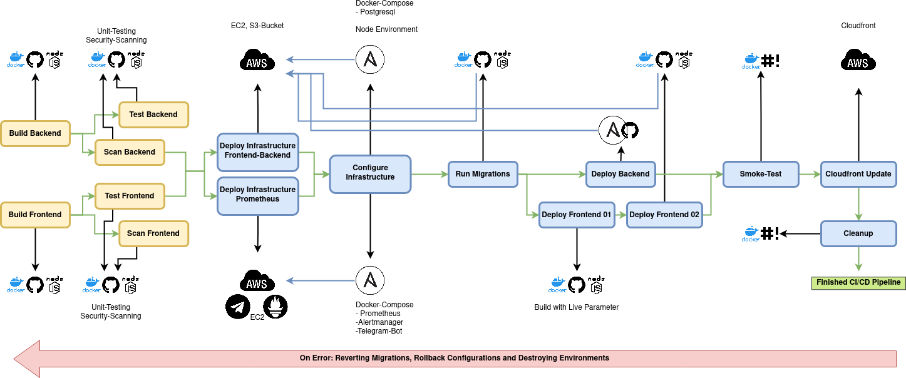

# Why do this?

{#id .class width=450 height=400px}

# Commit to Deploy

Git Repository as the Single Source of Trust:

  * any new Commit can trigger complete Build-Chain 
  * depending on Branch only Software-Build/-Test or complete Deployment
  * only successful Builds will be merged to master 

\vspace{1.5cm}

\begin{block}{\raisebox{-.5\height}{\includegraphics[width=10pt,height=10pt]{images/verify.png}} \raisebox{-0.5\height}{\hbox{Everything under Control}}}
Only Commited Code exists in Production. No lost/abandoned files. No missing Code.
\end{block}

# Security and Resiliency by Design

Building and Pipelining Language specific Testing and Security Scanning Tools
  
  * Run Unit Tests
  * Audit Source and Third Party Dependencies
  * Fix Vulnerabilities
  * only Continue if Tests and Scans success

\vspace{1.5cm}

\begin{block}{\raisebox{-.5\height}{\includegraphics[width=10pt,height=10pt]{images/verify.png}} \raisebox{-0.5\height}{\hbox{Everything under Control}}}
Any piece of Source Code will be tested and scanned. Third party imports will be tested and scanned. On every Commit.
\end{block}

# Infrastructure under Version Control

Use Easy Mergeble Configuration Files like yml or json:
  
  * Hardware described in human readable and commitable files
  * Easy Organisation of Engineering Teams by using Git Mechanics
  * Only running Configurations get documented and into Master Repository

\vspace{1.5cm}

\begin{block}{\raisebox{-.5\height}{\includegraphics[width=10pt,height=10pt]{images/verify.png}} \raisebox{-0.5\height}{\hbox{Everything under Control}}}
Easy Contribution of multiple Engineers. Changing configurations are 100\% documented.
\end{block}

# Measure Costs and Activities on Point

Cloudbased Applications are easily to monitor and provide very granular billing:

  * Cloudbased Instances provide easy APIs for monitoring and alerting
  * Costs are estimated by allocated Resources and only affects what you really used

\vspace{1.5cm}

\begin{block}{\raisebox{-.5\height}{\includegraphics[width=10pt,height=10pt]{images/verify.png}} \raisebox{-0.5\height}{\hbox{Everything under Control}}}
Only successful Builds create Costs. All operation parameters are monitored. You will be alerted on exceptions.
\end{block}

